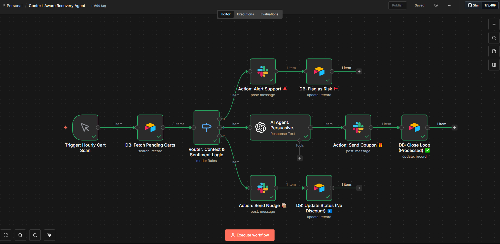

# 🛒 Context-Aware Cart Recovery Agent

> **"Don't send discount codes to angry customers." An emotionally intelligent automation that checks Customer Sentiment and Product Margins before sending cart recovery emails.**

## 🚨 The Problem: "Blind" Automation
Traditional "Cart Abandonment" bots are blind to context:
* **Brand Risk:** They annoy customers who have open support tickets or are angry with the brand.
* **Profit Erosion:** They offer discounts on low-margin products, bleeding revenue.
* **Generic Spam:** They send the same static "You forgot something!" template to everyone.

## ✅ The Solution
This is a **State-Aware Autonomous Agent**. It doesn't just check *time*; it checks *context*.
Before sending any message, the **Sentiment Router** scans the customer's support history. If they are "Angry," it halts the sales process and alerts the Support Team.
Simultaneously, the **Margin Guard** checks the product's profitability in Airtable. High-margin items get a dynamic discount; low-margin items get a friendly reminder.

## 🛠 Tech Stack & Architecture

| Component | Role |
|-----------|------|
| **n8n** | Logic routing, API orchestration, and state management. |
| **OpenAI (GPT-4o)** | **Sentiment Analysis:** Detects anger/frustration. **Copywriter:** Writes persuasive, non-templated emails. |
| **Airtable (DB)** | Stores Product Margins and Customer Support status. |
| **Slack API** | Alerts the support team if an "Angry" customer abandons a cart. |

## ⚙️ Workflow Logic

1.  **Trigger:** Cart Abandoned Event.
2.  **Agent 1: Sentiment Router (The Shield)**
    * *Check:* Scans recent support tickets/emails.
    * *Logic:* If Sentiment = "Negative/Angry" → **STOP**. Alert Human Support via Slack.
    * *Logic:* If Sentiment = "Neutral/Positive" → **PROCEED**.
3.  **Agent 2: Margin Guard (The CFO)**
    * *Check:* Looks up `Profit_Margin` in Airtable.
    * *Logic:* If Margin < 15% → Send Reminder (No Discount).
    * *Logic:* If Margin > 40% → Offer 10% Discount Coupon.
4.  **Agent 3: AI Copywriter**
    * Generates a unique email body based on the product and the offer type.
5.  **Closed-Loop:** Tags the customer to prevent duplicate processing.

## 🚀 How to Use

1.  Import `workflow.json` into n8n.
2.  Set up **Airtable** with `Products` (Margin Data) and `Customers` (Support Logs).
3.  Connect **OpenAI API** for sentiment analysis.
4.  Configure **Slack** for "Angry Customer" alerts.
5.  Stop burning bridges and margins!

---

## 📞 Contact & Support

If you are interested in this project or would like to discuss custom **n8n automation solutions** for your business, feel free to reach out.

👉 **Visit my Website:** [emrahdemirkoc.com](https://emrahdemirkoc.com)  
📧 **Email:** [emrahdemirkoc@gmail.com](mailto:emrahdemirkoc@gmail.com)
